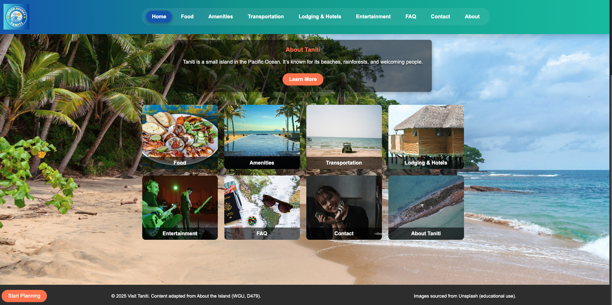

> 📌 **WGU D479: User Experience Design – Task 1 Submission**

# 🌴 Visit Taniti – Tourism Website Prototype  

This repository contains the source files for **WGU D479: User Experience Design – Task 1**.  
It is a prototype tourism website for the island of Taniti, designed to improve navigation, clarity, and user experience for visitors.  

---

## ✨ Key Features
- Responsive navigation with hamburger menu  
- Hero banner with **Start Planning** call-to-action  
- Pages: Home, Food, Amenities, Transportation, Lodging & Hotels, Entertainment, FAQ, Contact, and About  
- Interactive (demo) contact form  
- Consistent footer with content citations and image acknowledgments  

---

## 🧑 Persona
- **Name:** Dalia Thompson  
- **Age:** 42, IT Project Manager (USA)  
- **Trip Purpose:** Family vacation with children  
- **Needs:** Easy navigation on mobile, kid-friendly activities, clear lodging and transportation info  
- **Stay:** 5 days in a hotel, using a rental car  

This ensured the prototype focused on **simplicity, safety, and family-friendly planning**.  

---

## 📅 UX Design Process
1. **Research & Planning** – Reviewed survey results and island background  
2. **Persona Development** – Built persona to guide design  
3. **Wireframes** – Created low-fidelity wireframes  
4. **Guerrilla Usability Testing** – Feedback from 3 testers applied  
5. **Prototype Development** – HTML, CSS, and JavaScript build incorporating feedback  

---

## 📸 Citations
- Content adapted from *About the Island* (WGU, D479)  
- Images sourced from [Unsplash](https://unsplash.com) (educational use)  

---

## 🚀 Live Demo
👉 [Visit the Prototype](https://stackmindlab.github.io/taniti-tourism-prototype/)

---

## 🛠️ Tech Stack
- HTML5  
- CSS3  
- JavaScript  
- GitHub Pages  

---

## 📚 Course Reference
WGU – **D479: User Experience Design**

## 📸 Project Preview

